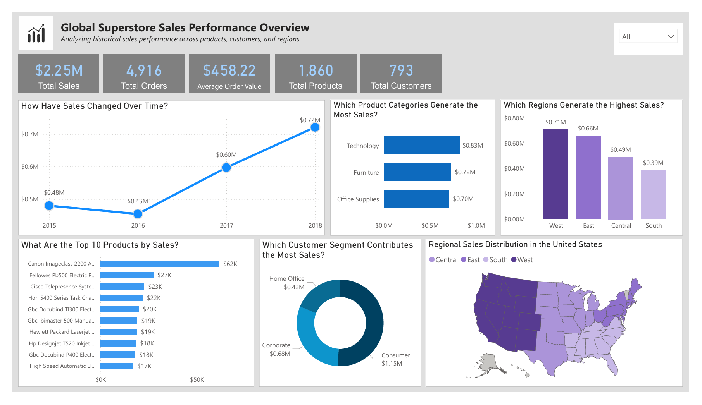
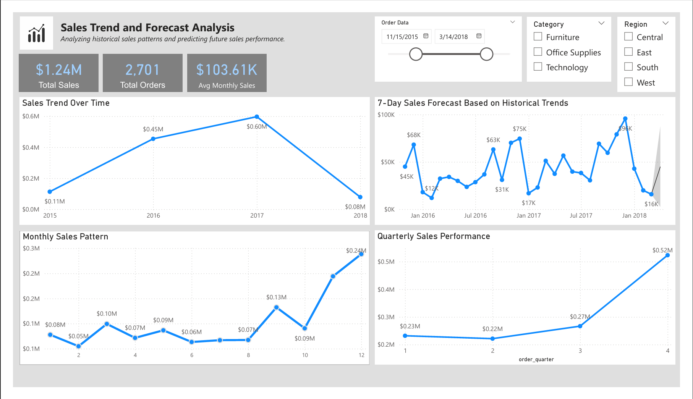

# Superstore Sales Analysis and Forecasting

## Project Overview

This project analyzes historical sales data from a global retail superstore to understand sales performance across products, regions, and customer segments.

The analysis also includes a short-term **7-day sales forecast** based on historical sales trends.

The goal of this project is to demonstrate an **end-to-end data analytics workflow**, including data preparation, SQL-based analysis, exploratory data analysis (EDA), dashboard development, and sales forecasting.

The project uses **Excel, PostgreSQL (SQL), and Power BI** to transform raw data into actionable business insights.

---

# Business Problem

Retail businesses need to understand historical sales performance to improve decision-making, optimize product strategies, and anticipate future demand.

This project aims to answer the following business questions:

1. Which **product categories generate the most sales**?
2. Which **regions contribute the highest revenue**?
3. Which **products drive the highest sales**?
4. What are the **sales trends over time**?
5. Can we **predict the next 7 days of sales** using historical data?

---

# Dataset

The dataset used in this project is the **Superstore Sales Dataset**, which contains four years of retail transaction data including product information, customer segments, geographic regions, and sales values.

Due to repository size and dataset distribution policies, the dataset is **not stored in this repository**.

Dataset details and download instructions can be found here:

`data/dataset_source.md`

---

# Tools Used

The project uses the following tools:

- **Excel** – Preliminary data inspection and validation  
- **PostgreSQL / SQL (via DBeaver)** – Data storage and analytical queries  
- **Power BI** – Dashboard development and forecasting  

---

# Project Workflow

The analysis follows a structured analytics workflow.

## 1 Data Preparation

The dataset was reviewed and validated to ensure accuracy and consistency.

Key steps included:

- Data inspection in Excel
- Data type verification
- Duplicate checks
- Missing value validation
- Importing data into PostgreSQL

Documentation:  
`documentation/data_preparation.md`

---

## 2 Exploratory Data Analysis (EDA)

Exploratory analysis was conducted to understand sales patterns and identify key performance drivers.

Areas explored include:

- Sales by product category
- Sales by sub-category
- Regional sales distribution
- Customer segment contribution
- Sales trends over time

Documentation:  
`analysis/eda_summary.md`

---

## 3 SQL Analysis

SQL queries were used to analyze business performance including:

- Overall sales KPIs
- Product performance
- Regional sales comparisons
- Customer segment analysis
- Time-series sales trends
- Shipping performance analysis

SQL scripts are included in:

`sql/`

---

## 4 Dashboard Development

A Power BI dashboard was created to visualize key metrics and insights.

The dashboard includes:

- Sales performance overview
- Product category analysis
- Regional sales performance
- Sales trends over time
- Interactive filtering

Documentation:  
`documentation/dashboard_design.md`

---

## 5 Sales Forecasting

A **7-day sales forecast** was generated using historical sales data.

This forecasting helps estimate short-term future demand and supports operational planning.

Documentation:  
`analysis/forecasting_analysis.md`

---

# Dashboard Preview

## Sales Performance Overview

---

## Sales Trends and Forecasting

---

# Key Insights

The analysis revealed several important business insights:

- **Technology products generate the highest revenue**
- **The West region contributes the largest share of total sales**
- **The Consumer segment drives the majority of revenue**
- **A small number of products generate a large portion of total sales**
- **Sales show a steady upward trend over time**

Detailed insights and recommendations can be found here:

`analysis/insights.md`

---

# Repository Structure
superstore-sales-analysis
│
├── analysis
│ ├── eda_summary.md
│ ├── forecasting_analysis.md
│ └── insights.md
│
├── dashboards
│ ├── sales_performance_overview.png
│ └── sales_trends_forecasting.png
│
├── data
│ └── dataset_source.md
│
├── documentation
│ ├── analysis_process.md
│ ├── dashboard_design.md
│ └── data_preparation.md
│
├── excel
│
├── powerbi
│ └── superstore_sales_dashboard.pbix
│
├── sql
│ ├── 01_create_database.sql
│ ├── 02_create_tables.sql
│ ├── 03_data_validation.sql
│ ├── 04_business_kpis.sql
│ ├── 05_product_performance.sql
│ ├── 06_geographic_analysis.sql
│ ├── 07_customer_segment_analysis.sql
│ ├── 08_time_series_analysis.sql
│ ├── 09_shipping_analysis.sql
│ └── 10_powerbi_views.sql
│
├── .gitattributes
├── LICENSE
└── README.md

---

# Project Outcome

This project demonstrates how historical sales data can be transformed into meaningful business insights through structured analysis and visualization.

By combining **SQL analysis, interactive dashboards, and forecasting**, the project shows how data analytics can support better business decision-making.

---

# Author

**Ben Policarpio**

Junior Data Analyst focused on building end-to-end analytics projects using **Excel, SQL, and Power BI**.